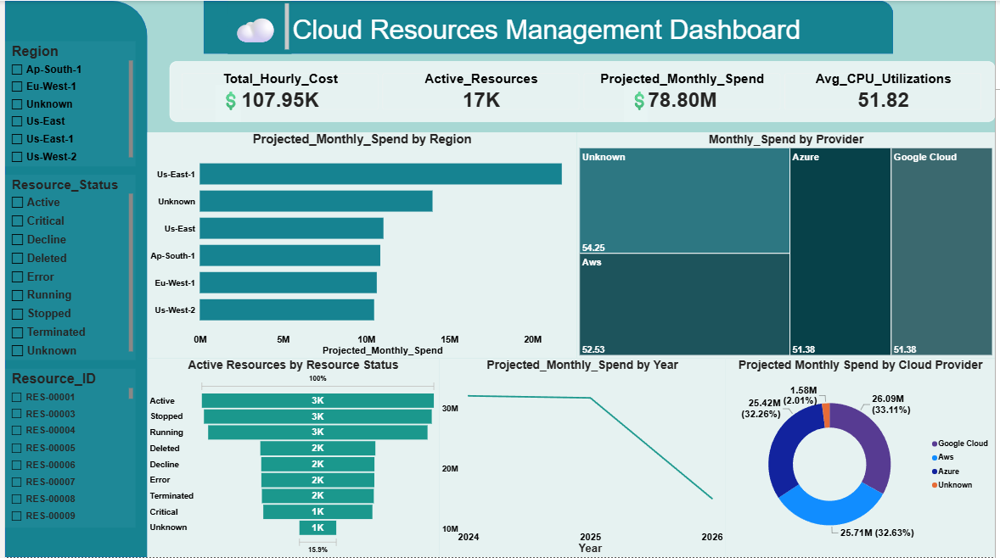

# Enterprise Cloud Infrastructure & FinOps Analytics Platform

An end-to-end data engineering and business intelligence platform that ingests, cleanses, and models **20,000 chaotic infrastructure telemetry logs** into a high-performance **Star Schema** dashboard to monitor a global cloud budget of **\$78.80 Million**.

## 📊 Live Dashboard Preview


---

## 🌟 Project Architecture & Highlights
* **Data Scale:** 20,000 transactional infrastructure records.
* **Financial Footprint:** \$78.80M projected monthly infrastructure burn rate.
* **Core Methodology:** Python preprocessing, Power Query text normalization, Star Schema relational modeling, and advanced DAX business metric engineering.
* **Cloud Infrastructure Scope:** Multi-cloud monitoring across Amazon Web Services (AWS), Microsoft Azure, and Google Cloud Platform (GCP).

---

## 🛠️ Step-by-Step Implementation Pipeline

### Phase 1: Automated Python Data Cleansing Pipeline (`src/clean_telemetry.py`)
The raw ingestion dataset (`raw_dirty_cloud_resources_data.csv`) contained severe system-logging anomalies: duplicate resource entries, negative costs, broken calendar date strings, and textual error logs inside numeric columns. 

A custom **Python (Pandas)** pipeline handles structural extraction and baseline sanitization:
* **Deduplication:** Strips whitespace and forces `Resource_ID` strings to uppercase, dropping duplicate logged entities.
* **Imputation:** Coerces messy cost parameters (e.g., values containing `$` text) to floats, replacing negative out-of-range figures with column medians.
* **Technical Constraints:** Extracts string text percentages from telemetry boundaries and purges impossible performance data (CPU utilization > 100%).
* **Categorical Unification:** Maps messy variations (`vm`, `virtual_machine`, `Virtual Machine`) into uniform corporate parameters.

### Phase 2: Power Query Ingestion & String Normalization (M-Code)
The preprocessed baseline file is ingested directly into Power BI Desktop. Advanced front-end string normalization rules flush out remaining blank string literals (`""`) and invisible background system breakers to achieve a **100% Solid Green Data Quality Bar**:
* **Text Engineering:** Applies `Trim`, `Clean`, and `Capitalize Each Word` steps across regional string metrics to prevent visual display block duplication.
* **M-Code Value Overrides:** Employs explicit conditional script logic inside the formula bar to catch hidden space variations and replace empty values with structured corporate placeholders:
  ```powerquery
  = Table.ReplaceValue(#"Prior Step Name", each [Owner_Email], each if [Owner_Email] = null or Text.Clean(Text.Trim([Owner_Email])) = "" then "unassigned@company.com" else [Owner_Email], Replacer.ReplaceValue, {"Owner_Email"})
  ```

### Phase 3: Star Schema Relational Data Modeling
To isolate analytical queries from operational storage bottlenecks, tables are structured into a high-performance **Star Schema** framework:
* **Dimension Table Generation (DAX):** Generates dedicated lookup tables to handle analytical slicing context:
  ```dax
  Dim_Calendar = CALENDAR(MIN('cleaned_cloud_resources_data'[Creation_Date]), MAX('cleaned_cloud_resources_data'[Creation_Date]))
  Dim_Region = DISTINCT(SELECTCOLUMNS('cleaned_cloud_resources_data', "Region", 'cleaned_cloud_resources_data'[Region]))
  Dim_Providers = DISTINCT(SELECTCOLUMNS('cleaned_cloud_resources_data', "Cloud_Provider", 'cleaned_cloud_resources_data'[Cloud_Provider]))
  ```
* **Chronological Sorting:** Attaches a custom `Month_Number = MONTH(Dim_Calendar[Date])` sorting attribute to text columns to prevent timeline data from displaying alphabetically.
* **Relationship Mappings:** Establishes unidirectional **1-to-Many (1:*) relationships** flowing downstream from dimension lookup points into the central telemetry fact table.

### Phase 4: Business Metric Architecture (DAX Measures)
Isolates calculation logic by programming custom analytical measures to translate raw infrastructure values into operational Key Performance Indicators:
* **Active Infrastructure Inventory:**
  ```dax
  KPI_Active_Resources = DISTINCTCOUNT('cleaned_cloud_resources_data'[Resource_ID])
  ```
* **Projected Monthly Financial Burn Rate (Standardized 730-Hour Cloud Month):**
  ```dax
  KPI_Projected_Monthly_Spend = SUM('cleaned_cloud_resources_data'[Hourly_Cost]) * 730
  ```
* **FinOps Optimization Target (Zombie Server Cost Tracking):** Scans for infrastructure components costing > \$1.50/hour but running idle below 15% CPU capacity to track corporate financial waste:
  ```dax
  KPI_Potential_Monthly_Savings = CALCULATE(SUM('cleaned_cloud_resources_data'[Hourly_Cost]), 'cleaned_cloud_resources_data'[CPU_Utilization_Pct] < 15, 'cleaned_cloud_resources_data'[Hourly_Cost] > 1.5) * 730
  ```

---

## 🎨 Dashboard Visual Layout Matrix
Designed with a responsive grid layout mapping macro-level financial overviews down to technical system infrastructure anomalies:
1. **Left Selection Control Dock:** A dark teal side panel clustering interactive filtering controls (`Region`, `Resource_Status`, `Resource_ID`) away from visualization displays.
2. **Executive KPI Header Row:** Four crisp metrics tracking total assets, hourly expenditure vectors, average performance, and projected monthly spend variables.
3. **Spend Allocation (Donut Chart):** Tracks budget footprints across providers, demonstrating equal splits (**~32-33%**) across GCP, AWS, and Azure.
4. **Active Inventory Status (Funnel Chart):** Groups resource states, isolating system load sizes across `Active`, `Stopped`, and `Running` states.
5. **Regional Expense View (Clustered Bar Chart):** Maps infrastructure cost centers globally, identifying `Us-East-1` as the primary expenditure driver.
6. **Asset Density Distribution (Treemap Matrix):** Allocates cost matrix groups by cloud provider segments.

---

## ⚙️ How to Deploy & Interact
1. Clone this repository: `git clone https://github.com`
2. Run the preprocessing data-cleansing pipeline: `python src/clean_telemetry.py`
3. Launch Power BI Desktop and open `models/Cloud_Resources_Dashboard.pbix`.
4. Click **Refresh** to populate the data model from the newly cleaned dataset.
